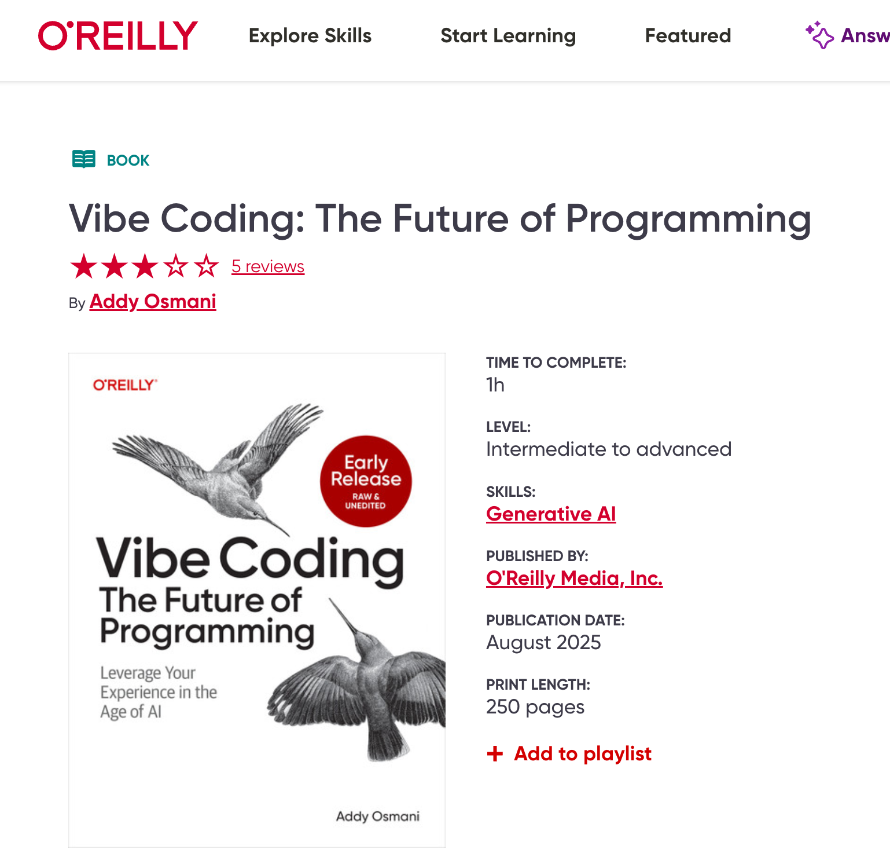

# 《Vibe编程实战》（Vibe Coding in Action）试读与配套代码

《Vibe编程实战》（Vibe Coding in Action）是一本讲解如何依靠AI编写代码的编程实用指南，面向非IT背景人士、资深IT人士和IT新人。全书通过六个实战案例——批量修改文件名、"一键减少AI幻觉"扣子应用、Excel数据可视化、Excel数据分析、Web应用原型和前后端分离Web应用开发，全面展示Vibe编程的实战技巧与避坑策略。不同于市面上仅面向专业开发者的图书，本书首次面向广大受众，既包含适合个人的快速项目开发流程，也涵盖从需求分析到代码评审的完整企业开发流程，让任何人都能运用Vibe编程快速解决实际问题。

## 目录（持续更新中；第6章可供试读）

序言

前言

Vibe编程的价值

目标读者

如何阅读

本书配套代码

致谢

作者简介

技术审稿者简介

第1章 颠覆传统的Vibe编程

1.1 用豆包批量改文件名

1.2 什么是Vibe编程

1.3 Vibe编程极简史

1.4 如何颠覆传统

1.5 代码生成的原理

1.6 比代码还重要的提示词

1.7 Vibe编程的风险

1.7.1 Vibe编程的四个典型场景

1.7.2 Vibe编程工具像孙悟空

1.8 Vibe编程完整过程

1.9 用实战体验Vibe编程

第2章 任何人可用扣子实现提示词优化应用

2.1 “一键减少AI幻觉“应用需求分析

2.2 编排

2.3 预览

2.4 发布

2.5 试用

2.6 分享

第3章 任何人可用DeepSeek可视化Excel数据

3.1 需求分析

3.2 生成HTML代码

3.3 运行HTML代码

3.4 浏览HTML代码

3.5 增加需求

第4章 任何人可用元宝分析Excel数据

4.1 需求分析

4.2 生成Python代码

4.3 运行Python代码

4.4 浏览Python代码

4.5 增加需求

第5章 产品经理用Lovable和Trae快速实现Web应用原型

5.1 Promptyoo-1 Web应用原型需求分析

5.2 用Lovable生成前后端一体化Next.js代码

5.3 使用Trae在本地电脑运行原型

5.4 浏览Python代码

5.5 增加需求

第6章 IT人士用GitHub Copilot实现前后端分离Web应用

6.1 Promptyoo-0 Web应用需求分析

6.2 架构设计与Ask模式

6.2.1 前后端分离的架构

6.2.2 用Ask子模式获取架构建议

6.3 任务拆解

6.4 用户界面与Vision

6.4.1 拼凑用户界面

6.4.2 为拼凑界面生成文字描述

6.4.3 用RABPOC生成高质量提示词

6.5 用bolt生成React前端代码

6.5.1 在本地电脑运行前端

6.5.2 看懂前端代码与/explain和#codebase

6.5.3 格式化代码与自动生成提交信息

6.5.4 用Inline Chat的/doc为代码加注释

6.5.5 用Inline Chat的/fix修复问题

6.6 Node.js后端代码

6.6.1 备好发给后端的提示词与Edit子模式

6.6.2 生成后端代码与Agent子模式

6.6.3 修复运行错误与Ask子模式下的@terminal

6.6.4 点按钮无反应与Ask子模式下的/fix

6.7 前端单元测试

6.7.1 搭建测试框架与/setupTests

6.7.2 验证按钮的前端单元测试与/tests

6.7.3 验证前端单元测试的保护效果

6.7.4 生成其他关键前端单元测试

6.8 后端单元测试

6.8.1 用/setupTest时踩坑

6.8.2 用Claude官网时踩坑

6.8.3 换思路用好Claude官网

6.8.4 验证后端单元测试的保护效果

6.9 代码评审

6.9.1 软件架构可视化与/explain

6.9.2 用Review and Comment评审代码

第7章 用实战来体验Vibe编程

7.1 非IT背景人士皆可Vibe编程

7.2 资深IT人士视Vibe编程工具如悟空

7.3 IT新人插上Vibe编程的翅膀

附录

## 版权许可协议

[《Vibe编程实战》（Vibe Coding in Action）](https://github.com/wubin28/book-vibe-coding-in-action) © 2025 作者 [吾真本](https://github.com/wubin28) 采用 [CC BY-NC-ND 4.0](https://creativecommons.org/licenses/by-nc-nd/4.0/?ref=chooser-v1) 许可协议

本书采用知识共享署名-非商业性使用-禁止演绎 4.0 国际许可协议（CC BY-NC-ND 4.0）进行许可。

该协议允许你分享本书，但有以下严格限制：

- 署名（BY）：分享时必须注明吾真本为原作者，不得隐瞒或更改此信息。
- 非商业性使用（NC）：本书仅限非商业用途，不得用于盈利或商业项目。
- 禁止演绎（ND）：你可以分享本书的原始版本，但不得改编、修改或重新创作。换言之，不能对本书内容进行任何改变或添加。

这个协议具体意味着：

- 可以分享，但不得更改：你可以在网上分享本书，但必须保持原样，不得修改任何内容。
- 禁止商业用途：本书不得用于任何商业环境，如广告、出版物或付费项目。
- 保护原作完整性：此协议帮助原作者维护作品的完整性和原创性，防止他人进行二次创作或商业利用。

简而言之，CC BY-NC-ND 4.0 是一个相对严格的协议。它允许自由分享本书，但禁止任何形式的改编或商业利用。

## 本书内容范围与结构

本书共分五部分：

第一部分：用一章介绍Vibe编程的基本情况和发展。

第二部分：用三章分别讲解如何使用扣子、DeepSeek和元宝这三款Vibe编程工具（支持手机、电脑和网页端）完成生活和工作中的常见项目。这部分内容适合所有读者，包括非IT背景人士、资深IT人士和IT新人：

- 提示词优化扣子应用
- Excel数据可视化
- Excel数据分析

第三部分：用一章介绍产品经理如何运用网页端和AI原生IDE类Vibe编程工具，快速创建Web应用原型。使用的工具包括：

- 网页端类：Lovable
- AI原生IDE类：Trae（国内版）

第四部分：用一章展示IT人士（包括IT新人和资深IT人士）如何利用网页端和AI插件IDE类Vibe编程工具，开发一个前后端分离的提示词优化Web应用，从而掌握不熟悉的新技术。使用的工具包括：

- 网页端类：bolt.new
- AI插件IDE类：GitHub Copilot

第五部分：用一章总结Vibe编程对非IT背景人士、资深IT人士和IT新人的意义，并为这三类人群提供运用Vibe编程的最佳实践指南

## 写作特点

本书不盲目采信Vibe编程工具厂商的官方文档和网红发布的内容，也不简单罗列网上可查的功能清单，而是通过具体的Vibe编程实战项目（作为暗线），系统讲解非IT背景人士、IT新人和资深IT人士如何利用Vibe编程解决实际问题（作为主线），为读者提供第一手的实践参考资料。

## 内容摘要

《Vibe编程实战》（Vibe Coding in Action）是一本面向非IT背景人士、资深IT人士和IT新人的实战指南。全书通过6个精选项目展示Vibe编程的实战技巧与避坑策略：批量修改文件名、"一键减少AI幻觉"扣子应用、Excel数据可视化、Excel数据分析、Web应用原型，以及前后端分离Web应用开发。书中详细介绍了9款主流工具的应用方法，包括豆包、扣子、DeepSeek、元宝、Lovable、Trae（国内版）、GitHub Copilot、bolt.new和Claude官网。

本书内容既包含适合个人的快速项目开发过程，也涵盖从需求分析到代码评审的完整企业开发流程。除了具体的编程过程和工具使用方法，本书还为三类目标读者提供了最佳实践和避坑指南，帮助读者把握Vibe编程的快速发展趋势。本书突破传统编程书籍的局限，让非IT技术背景人士也能通过Vibe编程高效解决实际问题，真正实现"人人皆可Vibe编程"的愿景。

## 目标读者

本书主要面向**三类Vibe编程新手：**

- 非IT背景人士：包括需要处理数据或构建产品原型的职场人士、研究人员和产品经理
- 资深IT人士：包括目前使用传统手工编程方法、希望了解Vibe编程特点的开发者
- IT新人：包括计算机专业应届毕业生或非计算机专业转码人士，希望通过AI快速入门编程

## 市场背景

Vibe编程的兴起源于2021年6月GitHub发布的GitHub Copilot。该工具能通过分析现有代码，在编程过程中自动提供多个版本的高质量代码补全和编写建议，其效果远超从编程问答网站手动复制粘贴代码的传统方式。截至2025年，Vibe编程工具已发展出四大类：

1. 手机App/电脑App/网页端类：如Claude、DeepSeek、豆包、元宝、扣子、bolt.new和Lovable；
2. AI插件IDE类：如GitHub Copilot、Augment Code和Cline；
3. AI原生IDE类：如Cursor和Windsurf；
4. 终端命令行类：如Claude Code和Aider。

Vibe编程（也称氛围式编程）是一种主要依赖AI生成代码，并可通过人工调整代码来满足简单用户需求的编程方式。使用者（包括非IT背景人士）只需用自然语言向工具描述需求，工具就能通过连接的大语言模型（LLM）生成软件代码。使用者可以在生成的代码基础上进行调整，实现具体需求。这使编程从手动编写转变为引导AI生成代码的过程。通过Vibe编程，即使编程新手也能开发简单的软件应用。这一术语由OpenAI创始团队成员Andrej Karpathy于2025年2月首次提出。Karpathy选择"氛围式"（vibe）这一称呼，是因为它创造了一种自然的人机协作氛围，而不是单纯关注代码本身。

根据国外知名程序员问答网站[StackOverflow](https://survey.stackoverflow.co/2024/ai)和知名编程工具厂商[JetBrains](https://www.jetbrains.com/lp/devecosystem-2024/#ai)2024年的调查报告显示，**约70%的开发者已采纳或计划采纳Vibe编程工具**——Stack Overflow调查为76%，JetBrains为69%。Vibe编程工具的核心价值在于**效率提升、学习加速和生产力优化**，特别是在自动化重复任务和降低认知负荷方面表现优异。随着技术日趋成熟，Vibe编程工具正逐渐成为开发者工作流程中的必备工具。

2024年8月20日，Cloudflare公司“开发人员关系与社区”副总裁Ricky Robinett在X.com上分享了一段视频：他8岁的女儿使用Vibe编程工具Cursor，仅用45分钟就开发出了一个AI聊天Web应用。[这段10分钟的视频](https://x.com/rickyrobinett/status/1825581674870055189?lang=en)吸引了270万人观看，生动展示了"人人皆可Vibe编程"的理念。

## 本书卖点

《Vibe编程实战》（Vibe Coding in Action）是一本讲解如何依靠AI编写代码的编程实用指南，面向非IT背景人士、资深IT人士和IT新人。全书通过六个实战案例——批量修改文件名、"一键减少AI幻觉"扣子应用、Excel数据可视化、Excel数据分析、Web应用原型和前后端分离Web应用开发，全面展示Vibe编程的实战技巧与避坑策略。不同于市面上仅面向专业开发者的图书，本书首次面向广大受众，既包含适合个人的快速项目开发流程，也涵盖从需求分析到代码评审的完整企业开发流程，让任何人都能运用Vibe编程快速解决实际问题。

- **实战导向，快速上手**：通过批量修改文件名、"一键减少AI幻觉"扣子应用、Excel数据可视化、Excel数据分析、Web应用原型，以及前后端分离Web应用开发这6个Vibe编程实战项目，帮助读者在实际开发中掌握Vibe编程的核心技巧，解决真实问题。
- **最新主流Vibe编程工具全覆盖**：详细讲解9**款主流Vibe编程工具**，涵盖最近1年（截至2025年5月）推出的元宝、bolt.new、lovable、DeepSeek官网和Trae（国内版），以及此前发布的GitHub Copilot、Claude官网、豆包和扣子，确保内容紧跟技术前沿。
- **从零基础到进阶**：不仅适合**IT从业者**，也适合**零基础职场人士、产品经理、研究人员**，降低AI编程的学习门槛。
- **长期价值**：不仅详解Vibe编程的实操方法，还针对非IT背景人士、资深IT人士和IT新人提供专属的最佳实践和避坑指南，帮助读者持续适应AI技术的发展。
- **全流程覆盖**：既包含适合个人的快速项目开发流程，也涵盖企业级软件开发的完整链条——从**需求分析、架构设计、任务拆解、代码编写、测试到代码评审**，帮助读者利用AI生成高质量、可维护的代码。

## 本书独特优势

- **受众广泛，突破传统局限**：区别于其他相关书籍主要面向程序员，本书首次同时面向非IT背景人士、资深IT人士和IT新人，填补市场空白，拓宽读者群体。
- **聚焦最新Vibe编程工具和实践**：涵盖2024～2025年新发布的6**款主流Vibe编程工具**（如扣子、元宝、bolt.new、lovable、DeepSeek官网和Trae国内版），以及2025年2月新提出的Vibe编程方法，确保内容时效性，领先同类书籍。
- **实战与提炼结合**：不只是讲解工具使用，更通过**项目实战+最佳实践+避坑指南**的组合，指导读者运用Vibe编程解决实际问题，培养持续适应AI技术发展的能力。
- **Vibe编程全流程**：涵盖个人项目的完整流程（**需求分析→代码生成→代码运行→代码浏览→需求迭代**），以及企业级软件开发的全链条（**需求分析→架构设计→任务拆解→编程→测试→代码评审**），展示AI如何实质性提升编程效率，而非仅停留在代码生成层面。
- **经久不衰的方法论**：即使未来Vibe编程工具迭代，书中提供的**Vibe编程最佳实践、提示词技巧、避坑指南**仍可持续适用，延长书籍生命周期。

## 1本同类书情况

截至2025年5月中旬，国内外图书市场仅有1本有代表性的相关图书正在创作中：

- 《Vibe Coding: The Future of Programming》；Addy Osmani；计划2025年8月出版；O’Reilly。该书虽已在线提供目录预览和两章试读，但主要面向职业软件开发者，缺乏对非 IT 背景人士如何运用 Vibe 编程解决实际问题的探讨



## 本代码库仓库结构

每章都有独立的目录，包含相应的项目代码示例。结构组织如下：

```
/ch01
...
/ch06
    ├── /frontend
    ├── /backend
    ├── /prompts
...
```

## 克隆配套代码

```
git clone https://github.com/wubin28/book-vibe-coding-in-action.git

# 或者
# git clone https://gitee.com/wubin28/book-vibe-coding-in-action.git

cd book-vibe-coding-in-action
```

## 贡献

本仓库与书籍创作同步维护。如果你发现任何问题、有改进建议或想要贡献代码，欢迎提出问题或提交拉取请求。

## 如何联系

作者vx: wuzhenben001；备注：vca

祝你vibe编程愉快！✨