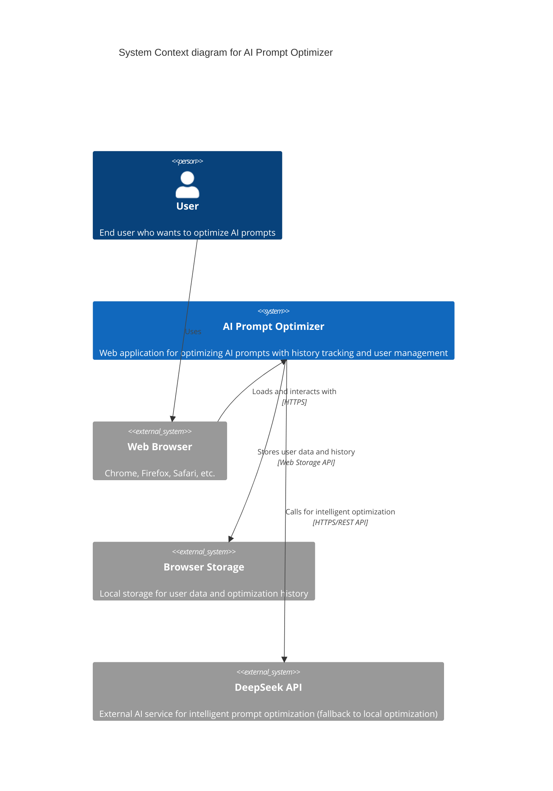
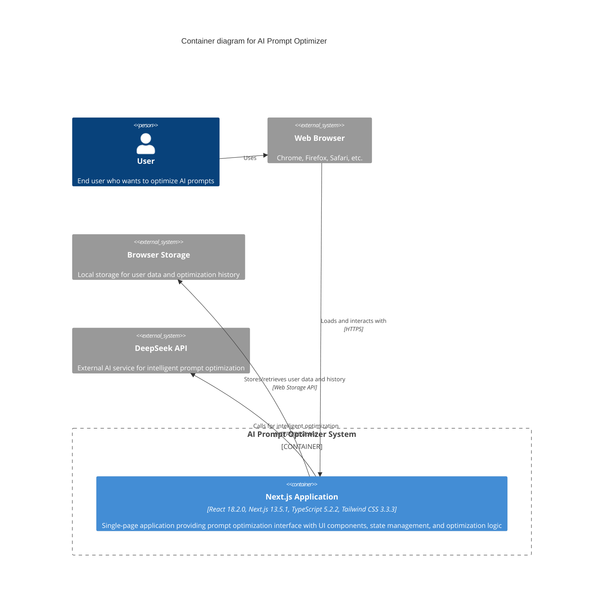
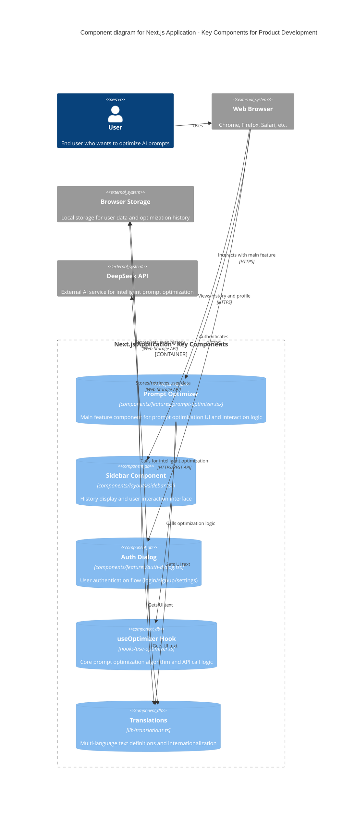

# C4 Model Architecture - 5 Key Components

This document contains simplified C4 model diagrams focusing on the 5 most frequently modified components during product development and prototyping.

## C4 Context Diagram

## C4 Container Diagram

## C4 Component Diagram - Key Components Only

## Key Components Overview

### 1. Prompt Optimizer (`components/features/prompt-optimizer.tsx`)
- **Purpose**: Main UI component for prompt input, optimization trigger, and result display
- **PM Focus**: User experience, input validation, loading states, result presentation
- **Frequent Changes**: UI layout, interaction flows, validation rules

### 2. Optimization Logic (`hooks/use-optimizer.ts`)
- **Purpose**: Core business logic for prompt optimization with API integration and fallback
- **PM Focus**: Optimization algorithms, API integration, error handling strategies
- **Frequent Changes**: Optimization rules, API endpoints, fallback logic

### 3. Translations (`lib/translations.ts`)
- **Purpose**: Multi-language support for all user-facing text
- **PM Focus**: Content strategy, user messaging, internationalization
- **Frequent Changes**: New text additions, content updates, language support

### 4. Sidebar (`components/layouts/sidebar.tsx`)
- **Purpose**: History management and user profile interface
- **PM Focus**: History organization, user engagement, navigation patterns
- **Frequent Changes**: History display logic, user interaction patterns

### 5. Auth Dialog (`components/features/auth-dialog.tsx`)
- **Purpose**: User authentication and account management
- **PM Focus**: User onboarding, authentication flow, account settings
- **Frequent Changes**: Registration flow, user data collection, settings options

## Development Priority

These 5 components represent the core product functionality that product managers typically iterate on during:
- Feature development and enhancement
- User experience optimization
- Content and messaging updates
- Business logic refinement
- User flow improvements 