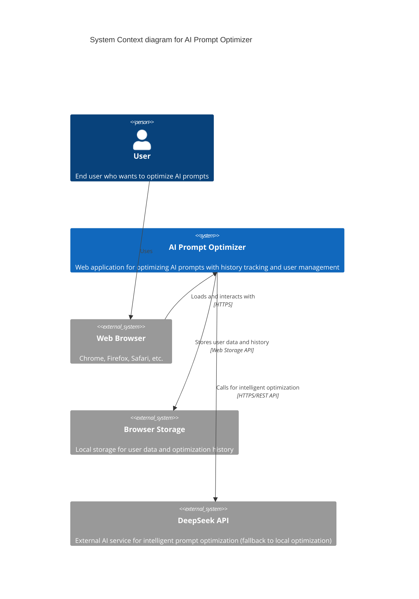
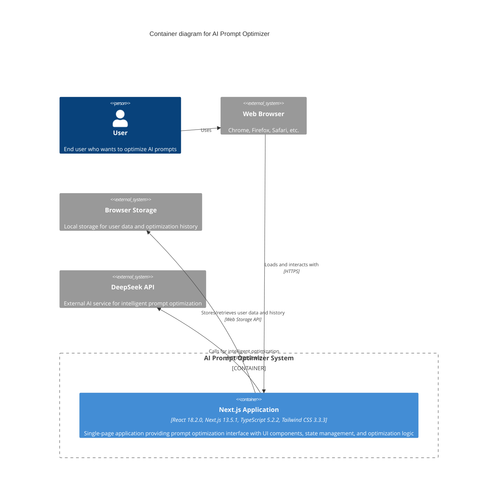

# C4 Model Context Level

```mermaid
C4Context
    title System Context diagram for AI Prompt Optimizer

    Person(user, "User", "End user who wants to optimize AI prompts")
    
    System(promptOptimizer, "AI Prompt Optimizer", "Web application for optimizing AI prompts with history tracking and user management")
    
    System_Ext(browser, "Web Browser", "Chrome, Firefox, Safari, etc.")
    System_Ext(localStorage, "Browser Storage", "Local storage for user data and optimization history")
    System_Ext(deepseekAPI, "DeepSeek API", "External AI service for intelligent prompt optimization (fallback to local optimization)")

    Rel(user, browser, "Uses")
    Rel(browser, promptOptimizer, "Loads and interacts with", "HTTPS")
    Rel(promptOptimizer, localStorage, "Stores user data and history", "Web Storage API")
    Rel(promptOptimizer, deepseekAPI, "Calls for intelligent optimization", "HTTPS/REST API")

    UpdateLayoutConfig($c4ShapeInRow="2", $c4BoundaryInRow="1")    
```

# C4 Model Container Level

```mermaid
C4Container
    title Container diagram for AI Prompt Optimizer

    Person(user, "User", "End user who wants to optimize AI prompts")
    
    System_Ext(browser, "Web Browser", "Chrome, Firefox, Safari, etc.")
    System_Ext(localStorage, "Browser Storage", "Local storage for user data and optimization history")
    System_Ext(deepseekAPI, "DeepSeek API", "External AI service for intelligent prompt optimization")

    Container_Boundary(promptOptimizerSystem, "AI Prompt Optimizer System") {
        Container(nextjsApp, "Next.js Application", "React 18.2.0, Next.js 13.5.1, TypeScript 5.2.2, Tailwind CSS 3.3.3", "Single-page application providing prompt optimization interface with UI components, state management, and optimization logic")
    }

    Rel(user, browser, "Uses")
    Rel(browser, nextjsApp, "Loads and interacts with", "HTTPS")
    Rel(nextjsApp, localStorage, "Stores/retrieves user data and history", "Web Storage API")
    Rel(nextjsApp, deepseekAPI, "Calls for intelligent optimization", "HTTPS/REST API")

    UpdateLayoutConfig($c4ShapeInRow="2", $c4BoundaryInRow="1")    
```

# C4 Model Component Level

```mermaid
C4Component
    title Component diagram for Next.js Application Container

    Person(user, "User", "End user who wants to optimize AI prompts")
    System_Ext(browser, "Web Browser", "Chrome, Firefox, Safari, etc.")
    System_Ext(localStorage, "Browser Storage", "Local storage for user data and optimization history")
    System_Ext(deepseekAPI, "DeepSeek API", "External AI service for intelligent prompt optimization")

    Container_Boundary(nextjsApp, "Next.js Application") {
        Component(rootLayout, "Root Layout", "app/layout.tsx", "Main application layout with providers and global styles")
        Component(homePage, "Home Page", "app/page.tsx", "Main page that renders the prompt optimizer interface")
        
        ComponentDb(mainLayout, "Main Layout", "components/layouts/main-layout.tsx", "Layout component with sidebar and header")
        ComponentDb(header, "Header Component", "components/layouts/header.tsx", "Top navigation with theme toggle and language switcher")
        ComponentDb(sidebar, "Sidebar Component", "components/layouts/sidebar.tsx", "Left sidebar with history and user profile")
        
        ComponentDb(promptOptimizer, "Prompt Optimizer", "components/features/prompt-optimizer.tsx", "Main feature component for prompt optimization")
        ComponentDb(authDialog, "Auth Dialog", "components/features/auth-dialog.tsx", "Authentication modal for login/signup/settings")
        
        ComponentDb(authProvider, "Auth Provider", "components/providers/auth-provider.tsx", "Authentication context and state management")
        ComponentDb(historyProvider, "History Provider", "components/providers/history-provider.tsx", "History management context and state")
        ComponentDb(languageProvider, "Language Provider", "components/providers/language-provider.tsx", "Multi-language support context")
        ComponentDb(themeProvider, "Theme Provider", "components/providers/theme-provider.tsx", "Dark/light theme management")
        
        ComponentDb(useAuth, "useAuth Hook", "hooks/use-auth.ts", "Authentication state and operations hook")
        ComponentDb(useHistory, "useHistory Hook", "hooks/use-history.ts", "History management operations hook")
        ComponentDb(useLanguage, "useLanguage Hook", "hooks/use-language.ts", "Language switching operations hook")
        ComponentDb(useOptimizer, "useOptimizer Hook", "hooks/use-optimizer.ts", "Core prompt optimization logic hook")
        
        ComponentDb(translations, "Translations", "lib/translations.ts", "Multi-language text definitions")
        ComponentDb(utils, "Utilities", "lib/utils.ts", "Common utility functions and helpers")
        ComponentDb(types, "Type Definitions", "types/index.ts", "TypeScript type definitions")
        
        ComponentDb(uiComponents, "UI Components", "components/ui/*", "shadcn/ui component library (40+ components)")
    }

    Rel(user, browser, "Uses")
    Rel(browser, rootLayout, "Loads", "HTTPS")
    Rel(rootLayout, homePage, "Renders")
    Rel(homePage, mainLayout, "Uses")
    
    Rel(mainLayout, header, "Contains")
    Rel(mainLayout, sidebar, "Contains")
    Rel(mainLayout, promptOptimizer, "Contains")
    
    Rel(header, useLanguage, "Uses")
    Rel(header, themeProvider, "Uses")
    Rel(sidebar, useAuth, "Uses")
    Rel(sidebar, useHistory, "Uses")
    Rel(promptOptimizer, useOptimizer, "Uses")
    Rel(promptOptimizer, useHistory, "Uses")
    
    Rel(authDialog, useAuth, "Uses")
    Rel(authProvider, useAuth, "Provides")
    Rel(historyProvider, useHistory, "Provides")
    Rel(languageProvider, useLanguage, "Provides")
    
    Rel(useAuth, localStorage, "Stores user data", "Web Storage API")
    Rel(useHistory, localStorage, "Stores history", "Web Storage API")
    Rel(useLanguage, localStorage, "Stores preference", "Web Storage API")
    Rel(useOptimizer, deepseekAPI, "Calls for optimization", "HTTPS/REST API")
    
    Rel(header, translations, "Uses")
    Rel(sidebar, translations, "Uses")
    Rel(promptOptimizer, translations, "Uses")
    Rel(authDialog, translations, "Uses")
    
    Rel_Back(uiComponents, promptOptimizer, "Provides UI")
    Rel_Back(uiComponents, authDialog, "Provides UI")
    Rel_Back(uiComponents, header, "Provides UI")
    Rel_Back(uiComponents, sidebar, "Provides UI")
    
    Rel(utils, types, "Uses")

    UpdateLayoutConfig($c4ShapeInRow="4", $c4BoundaryInRow="1")    
```