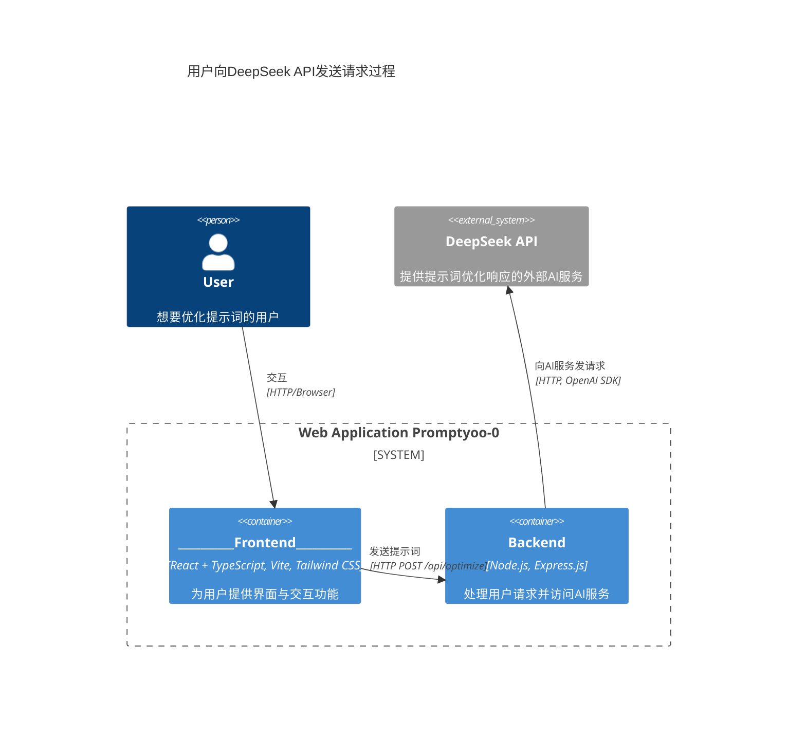

# Promptyoo-0 C4模型软件架构图（生成代码前期望的架构图）

```mermaid
C4Context
    title 用户向DeepSeek API发送请求过程
    Person(user, "User", "想要优化提示词的用户")
    
    System_Boundary(webApp, "Web Application Promptyoo-0") {
        Container(frontend, "__________Frontend__________", "React + TypeScript, Vite, Tailwind CSS", "为用户提供界面与交互功能")
        Container(backend, "Backend", "Node.js, Express.js", "处理用户请求并访问AI服务")
    }
    
    System_Ext(deepseekAPI, "DeepSeek API", "提供提示词优化响应的外部AI服务")
    
    Rel(user, frontend, "交互", "HTTP/Browser")
    Rel(frontend, backend, "发送提示词", "HTTP POST /api/optimize")
    Rel(backend, deepseekAPI, "向AI服务发请求", "HTTP, OpenAI SDK")
    
    UpdateRelStyle(user, frontend, $offsetY="-50", $offsetX="10")
    UpdateRelStyle(frontend, backend, $offsetY="-30", $offsetX="-40")
    UpdateRelStyle(backend, deepseekAPI, $offsetY="-40", $offsetX="10")
```