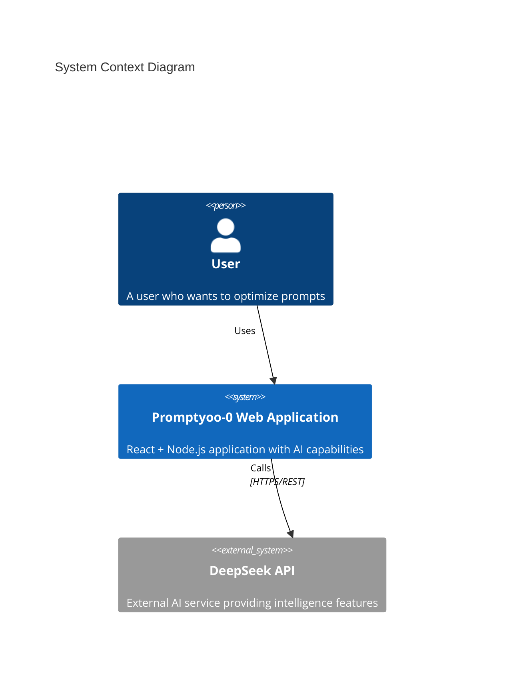
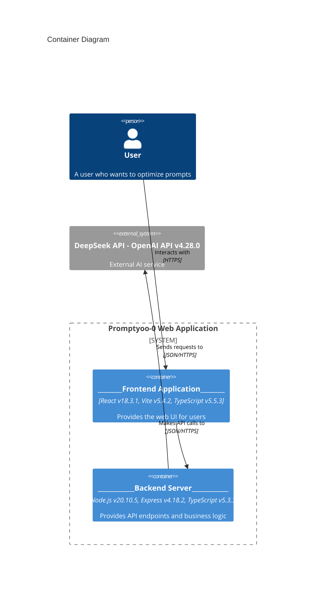
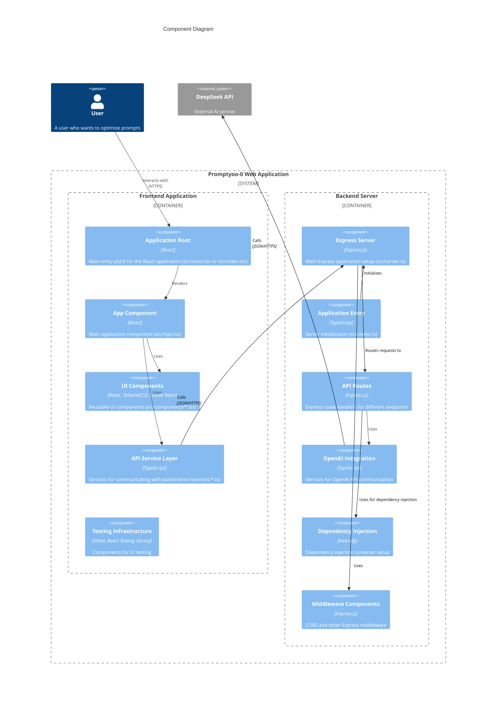
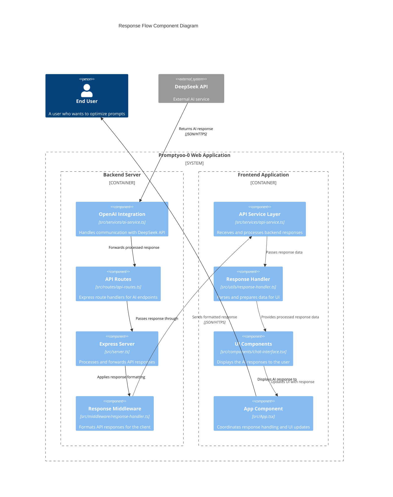

# Promptyoo-0 C4模型软件架构图（生成代码后实际的架构图）

## Context Layer Diagram

```mermaid
C4Context
    title System Context Diagram

    Person(user, "User", "A user who wants to optimize prompts")

    System(webApp, "Promptyoo-0 Web Application", "React + Node.js application with AI capabilities")

    System_Ext(deepseek, "DeepSeek API", "External AI service providing intelligence features")

    Rel(user, webApp, "Uses")
    Rel(webApp, deepseek, "Calls", "HTTPS/REST")

    UpdateRelStyle(user, webApp, $textColor="black", $lineColor="black", $offsetX="-40", $offsetY="-20")
    UpdateRelStyle(webApp, deepseek, $textColor="black", $lineColor="black", $offsetX="-40", $offsetY="-40")
```

## Containers Layer Diagram

```mermaid
C4Container
    title Container Diagram

    Person(user, "User", "A user who wants to optimize prompts")

    System_Boundary(webApp, "Promptyoo-0 Web Application") {
        Container(frontendApp, "________Frontend Application________", "React v18.3.1, Vite v5.4.2, TypeScript v5.5.3", "Provides the web UI for users")
        Container(backendServer, "____________Backend Server____________", "Node.js v20.10.5, Express v4.18.2, TypeScript v5.3.3", "Provides API endpoints and business logic")
    }

    System_Ext(deepseek, "DeepSeek API - OpenAI API v4.28.0", "External AI service")

    Rel(user, frontendApp, "Interacts with", "HTTPS")
    Rel(frontendApp, backendServer, "Makes API calls to", "JSON/HTTPS")
    Rel(backendServer, deepseek, "Sends requests to", "JSON/HTTPS")

    UpdateRelStyle(user, frontendApp, $textColor="black", $lineColor="black", $offsetY="-50")
    UpdateRelStyle(frontendApp, backendServer, $textColor="black", $lineColor="black", $offsetX="-50", $offsetY="-50")
    UpdateRelStyle(backendServer, deepseek, $textColor="black", $lineColor="black", $offsetY="-50")

```

## Components Layer Diagram - Request

```mermaid
C4Component
    title Component Diagram

    Person(user, "User", "A user who wants to optimize prompts")

    System_Boundary(webApp, "Promptyoo-0 Web Application") {
        Container_Boundary(frontendApp, "Frontend Application") {
            Component(appRoot, "Application Root", "React", "Main entry point for the React application (src/main.tsx or src/index.tsx)")
            Component(appComponent, "App Component", "React", "Main application component (src/App.tsx)")
            Component(uiComponents, "UI Components", "React, TailwindCSS, Lucide React", "Reusable UI components (src/components/*.tsx)")
            Component(apiService, "API Service Layer", "TypeScript", "Services for communicating with backend (src/services/*.ts)")
            Component(testInfra, "Testing Infrastructure", "Vitest, React Testing Library", "Components for UI testing")
        }

        Container_Boundary(backendServer, "Backend Server") {
            Component(expressServer, "Express Server", "Express.js", "Main Express application setup (src/server.ts)")
            Component(appEntry, "Application Entry", "TypeScript", "Server initialization (src/index.ts)")
            Component(apiRoutes, "API Routes", "Express.js", "Express route handlers for different endpoints")
            Component(openaiIntegration, "OpenAI Integration", "TypeScript", "Services for OpenAI API communication")
            Component(diContainer, "Dependency Injection", "Inversify", "Dependency injection container setup")
            Component(middleware, "Middleware Components", "Express.js", "CORS and other Express middleware")
        }
    }

    System_Ext(deepseek, "DeepSeek API", "External AI service")

    Rel(user, appRoot, "Interacts with", "HTTPS")
    Rel(appRoot, appComponent, "Renders")
    Rel(appComponent, uiComponents, "Uses")
    Rel(appComponent, apiService, "Uses")
    Rel(apiService, expressServer, "Calls", "JSON/HTTPS")
    Rel(appEntry, expressServer, "Initializes")
    Rel(expressServer, apiRoutes, "Routes requests to")
    Rel(expressServer, middleware, "Uses")
    Rel(apiRoutes, openaiIntegration, "Uses")
    Rel(apiRoutes, diContainer, "Uses for dependency injection")
    Rel(openaiIntegration, deepseek, "Calls", "JSON/HTTPS")

    UpdateRelStyle(apiService, expressServer, $textColor="black", $lineColor="black", $offsetX="-250", $offsetY="120")
    UpdateRelStyle(openaiIntegration, deepseek, $textColor="black", $lineColor="black", $offsetX="-90", $offsetY="-120")
    UpdateRelStyle(apiRoutes, diContainer, $textColor="black", $lineColor="black", $offsetX="1", $offsetY="100")
    UpdateRelStyle(expressServer, middleware, $textColor="black", $lineColor="black", $offsetX="1", $offsetY="400")
    UpdateRelStyle(expressServer, apiRoutes, $textColor="black", $lineColor="black", $offsetX="5", $offsetY="90")
    UpdateRelStyle(appEntry, expressServer, $textColor="black", $lineColor="black", $offsetX="5", $offsetY="-30")

```

## Components Layer Diagram - Response

```mermaid
C4Component
    title Response Flow Component Diagram

    Person(user, "End User", "A user who wants to optimize prompts")

    System_Boundary(webApp, "Promptyoo-0 Web Application") {
        Container_Boundary(backendServer, "Backend Server") {
            Component(openaiIntegration, "OpenAI Integration", "src/services/ai-service.ts", "Handles communication with DeepSeek API")
            Component(apiRoutes, "API Routes", "src/routes/api-routes.ts", "Express route handlers for AI endpoints")
            Component(expressServer, "Express Server", "src/server.ts", "Processes and forwards API responses")
            Component(middleware, "Response Middleware", "src/middleware/response-handler.ts", "Formats API responses for the client")
        }

        Container_Boundary(frontendApp, "Frontend Application") {
            Component(apiService, "API Service Layer", "src/services/api-service.ts", "Receives and processes backend responses")
            Component(responseHandler, "Response Handler", "src/utils/response-handler.ts", "Parses and prepares data for UI")
            Component(uiComponents, "UI Components", "src/components/chat-interface.tsx", "Displays the AI responses to the user")
            Component(appComponent, "App Component", "src/App.tsx", "Coordinates response handling and UI updates")
        }
    }

    System_Ext(deepseekAPI, "DeepSeek API", "External AI service")

    Rel(deepseekAPI, openaiIntegration, "Returns AI response", "JSON/HTTPS")
    Rel(openaiIntegration, apiRoutes, "Forwards processed response")
    Rel(apiRoutes, expressServer, "Passes response through")
    Rel(expressServer, middleware, "Applies response formatting")
    Rel(middleware, apiService, "Sends formatted response", "JSON/HTTPS")
    Rel(apiService, responseHandler, "Passes response data")
    Rel(responseHandler, uiComponents, "Provides processed response data")
    Rel(uiComponents, appComponent, "Updates UI with response")
    Rel(appComponent, user, "Displays AI response to")

    UpdateRelStyle(deepseekAPI, openaiIntegration, $textColor="black", $lineColor="black", $offsetX="50", $offsetY="-80")
    UpdateRelStyle(openaiIntegration, apiRoutes, $textColor="black", $lineColor="black", $offsetX="-80", $offsetY="-16")
    UpdateRelStyle(expressServer, middleware, $textColor="black", $lineColor="black", $offsetX="-100", $offsetY="-16")
    UpdateRelStyle(appComponent, user, $textColor="black", $lineColor="black", $offsetX="260", $offsetY="400")
    UpdateRelStyle(apiRoutes, expressServer, $textColor="black", $lineColor="black", $offsetX="20", $offsetY="5")

```